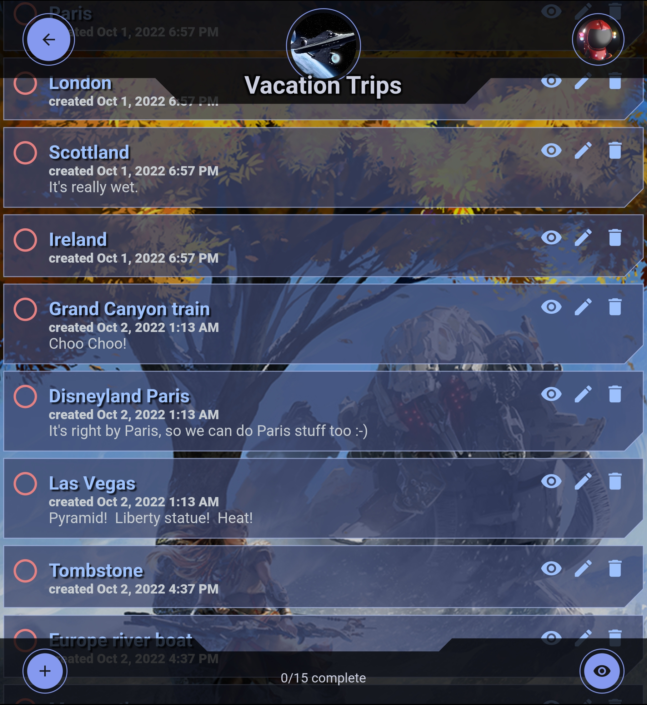

# DoMe

Track todo items.  Each item has a name, description, creation date, and complete date for when it is marked as completed.  

Features:
* Written in Flutter.
* This project uses Firebase to store projects (includes auth, storage, and their no-SQL database).
* Each project has its own list of todo items.
* Projects can be shared with other users.
* Each user can choose their own avatar image and custom background image.

To get the app to build:

* You'll need your own firebase account, follow their directions to get the google-services.json file into the project.
* You'll need to create a file under lib/config called app_encryption_settings.dart, here's a sample of the contents:

<pre>
    const String kAppEncryptionGeneralKey = 'your secret key goes here';
    const int kAppEncryptIVLength = 16;
</pre>
